<style>
    * {
        font-family: "Consolas";
    }

    .disable-href-underline {
        text-decoration: none;
    }
</style>
<!-- Marp Global Settings -->


# PnP AI Study
##### 23.05.24 (Week 4)


<br>


1. Step 2-2: Dataframe 다루기
2. Step 2-3: 데이터 분석과 시각화


---

### Dataframe - Indexing (1)

<a 
    href="https://pandas.pydata.org/docs/reference/api/pandas.DataFrame.loc.html" class="disable-href-underline">
    pandas.DataFrame.loc
</a>

DataFrame의 loc 프로퍼티를 이용하여 
원하는 row/col을 가져올 수 있습니다.

```python
# 특정 row만 가져올 때
DataFrame.loc[["인덱스", "배열"]]

# 특정 row와 col을 가져올 때
DataFrame.loc[["인덱스", "배열"], ["col", "이름", "배열"]]

# A부터 B까지의 row와 C부터 D까지의 col을 가져올 때
DataFrame.loc["A":"B", "C":"D"]
```

---

### 예제


```csv
# iphone.csv 파일

,출시일,디스플레이,메모리,출시 버전,Face ID
iPhone 7,2016-09-16,4.7,2GB,iOS 10.0,No
iPhone 7 Plus,2016-09-16,5.5,3GB,iOS 10.0,No
iPhone 8,2017-09-22,4.7,2GB,iOS 11.0,No
iPhone 8 Plus,2017-09-22,5.5,3GB,iOS 11.0,No
iPhone X,2017-11-03,5.8,3GB,iOS 11.1,Yes
# 이하 생략
```

```python
import pandas

iphone = pandas.read_csv("iphone.csv", index_col=0)
iphone.loc["iPhone 7":"iPhone 8", ["출시일", "메모리", "출시 버전"]]
```

---

### 결과

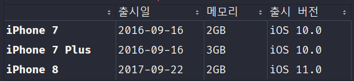

iPhone7부터 iPhone8 까지의 출시일, 메모리, 출시 버전을 출력

---

### DataFrame - Indexing (2)

**파이썬 상식** - 매직 메소드 `__getitem__`

파이썬에서 객체에 []를 이용해서 접근하려고 하면
(ex: `some_array[1]`, `some_dict["key_name"]` 등)   
파이썬 내부적으로는 `__getitem__` 메소드를 호출합니다.

즉, `some_array[1]`을 실행하면 파이썬 내부에서는
`some_array.__getitem__(1)`으로 변환되어 작동한다는 소리죠.

pandas에서는 이를 이용하여 쉽고 빠르게
특정 column만을 가져올 수 있도록 되어있습니다.

---

<a class="disable-href-underline">
    pandas.DataFrame.__getitem__
</a>


DataFrame의 `__getitem__`을 이용하면
빠르게 column을 필터링 할 수 있습니다.
<br>

### 예제

```python
# import, read_csv 생략

iphone[["출시일", "출시 버전"]]
```

---

### 결과

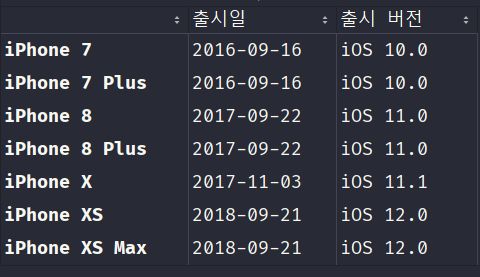

column 중 출시일, 출시 버전만 출력

---

### DataFrame - Filtering (조건부 인덱싱) (1)

pandas에서 DataFrame.loc 프로퍼티에 boolean 타입의
배열을 넣어주면 True인 위치의 값만 가져올 수 있습니다.

```python
iphone.loc[[True, False, True, False, True, False, True]]
```
> 주의: index 부분에는 index의 길이와 같은 크기의 boolean 배열을, column 부분에는 column의 길이와 같은 크기의 배열을 넣어줘야 합니다.


---

### 결과

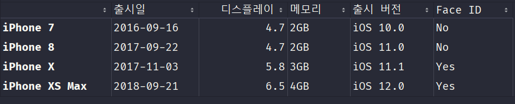

값이 True인 0, 2, 4, 6번째의 값만 출력

---

### DataFrame - Filtering (조건부 인덱싱) (2)

pandas의 DataFrame의 column의 Series는
(ex: `iphone["출시일"]`의 경우 "출시일" column의 Series)
비교 연산 (>, ==, < 등)을 하면 해당 결과를
모든 row에 대해 연산한 Series를 반환해줍니다.
이를 이용하면 DataFrame의 필터링에 유용하게 사용 가능합니다.

---

### 비교연산 예제

```python
iphone["Face ID"] == "Yes"
```
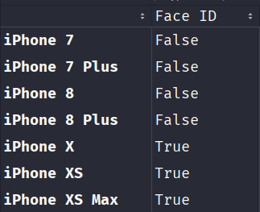
Face ID가 Yes인 값만 True인 pandas.Series를 출력

---

### 비교연산을 이용한 필터링
```python
has_face_id = iphone["Face ID"] == "Yes"
iphone.loc[has_face_id]
```
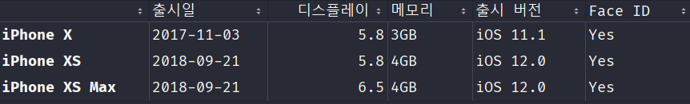
Face ID가 Yes인 row만 출력

---

### 다중 조건 필터링
Series끼리도 비교 연산이 가능하다는 점을 이용하면
조건이 여러개여도 필터링이 가능합니다.

---

### 예제
```python
has_face_id = iphone["Face ID"] == "Yes"
big_display = iphone["디스플레이"] > 5.5
iphone.loc[(has_face_id & big_display)]
```
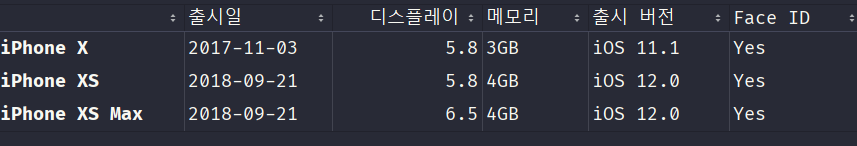
Face ID가 Yes이고 디스플레이가 5.5보다 큰 값만 출력

---

### DataFrame - Indexing (3)
<a 
    href="https://pandas.pydata.org/docs/reference/api/pandas.DataFrame.iloc.html"
    class="disable-href-underline">
    pandas.DataFrame.iloc
</a>

loc와 기본적으로 비슷하지만,
위치를 기반으로 Indexing이 가능합니다.

> 참고: 일반적인 list와 같이 0번부터 시작합니다.

---

### 예제

```python
iphone.iloc[[1, 3], [2, 3]]
```
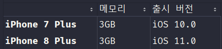
1, 3번의 row, 2, 3번의 column이 출력됨

---

### DataFrame - Writing (1)

<a class="disable-href-underline">
    pandas.DataFrame.__setitem__
</a>

단순히 `__getitem__`와는 반대로 작동하는 매직 메소드.

`some_arr[1] = "Someting"`의 경우에는
`some_arr.__setitem__(1, "Something")`으로 변환되어 작동됩니다.


이를 이용해서 Indexing, Filtering 등으로
선택한 DataFrame에 대입 연산자를 통해 값을 넣어주면
그 값이 원본의 DataFrame에도 반영됩니다.

---

### 예제
```python
has_face_id = iphone["Face ID"] == "Yes"

iphone.loc[has_face_id, "Face ID"] = True
iphone.loc[~has_face_id, "Face ID"] = False     # Python에서 '~'는 비트연산 Not을 의미 

iphone
```

---

### 결과
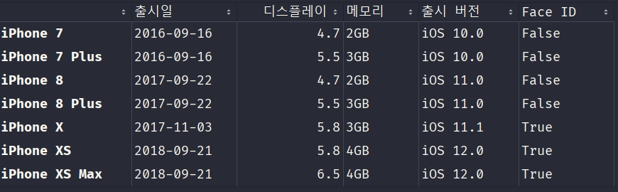

Face ID가 Yes인 row는 True로,
Yes가 아닌 row는 False로 값이 바뀜

---

### DataFrame - Writing (2)

위와 같지만, column이 존재하지 않는다면
자동으로 새 column을 생성합니다.

<br>

#### 예제
```python
iphone["출시 가격"] = 1000000
```
---

### 결과

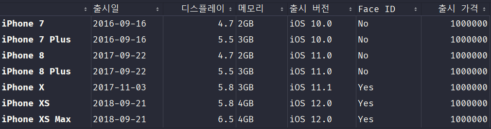

자동으로 출시 가격 column을 생성하여 대입함

---

### DataFrame - Deleting

<a 
    href="https://pandas.pydata.org/docs/reference/api/pandas.DataFrame.drop.html"
    class="disable-href-underline">
    pandas.DataFrame.drop
</a>

DataFrame의 drop 메소드를 이용하면 원하는 row/column을 삭제 가능합니다.

```python
# some_dataframe에서 "인덱스", "리스트" row를 삭제한 DataFrame 반환
some_dataframe.drop(["인덱스", "리스트"], axis="index")

# some_dataframe에서 "column", "list" column을 삭제한 DataFrame 반환
some_dataframe.drop(["column", "list"], axis="columns")
```
<p style="font-size:70%">drop 메소드 인수로 `inplace=True`를 추가해 주면 원본 DataFrame에도 적용됩니다. </p>

---

### 예제 1
```python
iphone.drop(["iPhone 8"], axis="index", inplace=True)
iphone
```

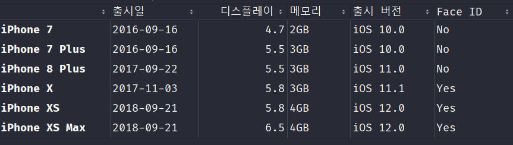

iPhone 8이 삭제되서 출력

---

### 예제 2
```python
iphone.drop(["출시 버전"], axis="columns", inplace=True)
iphone
```

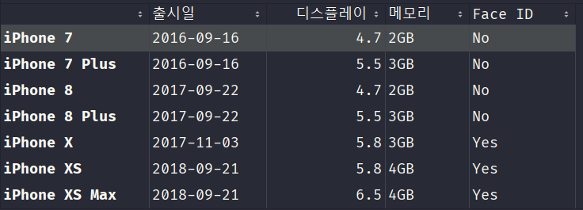

출시 버전 column이 삭제되서 출력

---

### DataFrame - Renaming

<a 
    href="https://pandas.pydata.org/docs/reference/api/pandas.DataFrame.rename.html"
    class="disable-href-underline">
    pandas.DataFrame.rename
</a>

DataFrame의 rename 메소드를 이용하면 column의 이름을 변경할 수 있습니다.

```python
# "column"은 "열"로, "name"은 "이름"으로 column 이름을 변경
some_dataframe.rename(columns={
    "column": "열",
    "name": "이름"
})
```

<p style="font-size:70%">rename 메소드도, 인수에 `inaple=True`를 추가해 주면 원본 DataFrame에 적용됩니다. </p>

---

### 예제

```python
iphone.rename(columns={
    "출시일": "Release Date"
}, inplace=True)
iphone
```
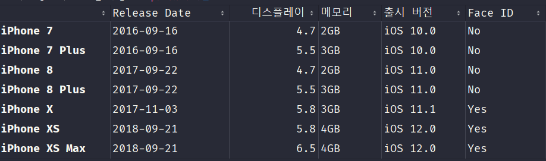
출시일이 Release Date로 변경되어 출력

---

### DataFrame - Index 변경

<a 
    href="https://pandas.pydata.org/docs/reference/api/pandas.DataFrame.set_index.html"
    class="disable-href-underline">
    pandas.DataFrame.set_index
</a>

DataFrame의 set_index 메소드를 통해
Index로 사용할 column을 지정해 줄 수 있습니다.

```python
# set_dataframe의 "column_name" column을 index로 설정
some_dataframe.set_index("column_name")
```

이것 역시 인수에 `inplace=True`를 넣어주면
원본 DataFrame에 반영됩니다.

---

### 예제
```python
iphone.set_index("출시일", inplace=True)
iphone
```

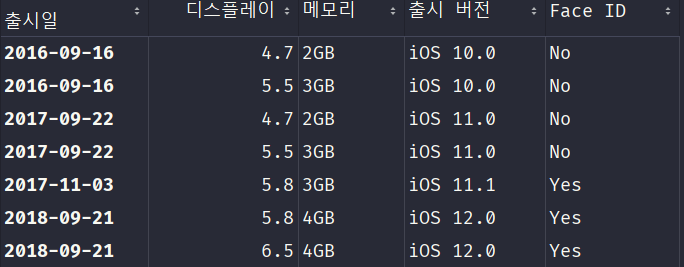

출시일 column이 index로 변경되어 출력

---

<p style="font-size:70%">
다만, 이러면 원래의 Index가 사라져서 이용할 수 없게 됩니다.<br>
이럴때는 index를 새로운 column으로 지정해 주면
문제가 해결됩니다.
</p>

```python
iphone["Name"] = iphone.index   # 원래 인덱스를 Name column으로 지정
iphone.set_index("출시일", inplace=True)    # 그 후 출시일을 index로 사용
iphone
```

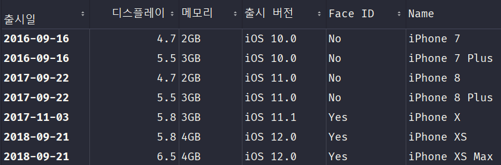

---

### DataFrame - head/tail


<a 
    href="https://pandas.pydata.org/docs/reference/api/pandas.DataFrame.head.html"
    class="disable-href-underline">
    pandas.DataFrame.head
</a>

DataFrame의 위쪽 n개의 row만 선택하는 메소드

<a 
    href="https://pandas.pydata.org/docs/reference/api/pandas.DataFrame.tail.html"
    class="disable-href-underline">
    pandas.DataFrame.tail
</a>
DataFrame의 아래쪽 n개의 row만 선택하는 메소드

---

### 예제 - head

```python
iphone.head(3)
```
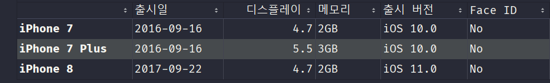

위쪽 3개만 출력

---

### 예제 - tail

```python
iphone.tail(3)
```
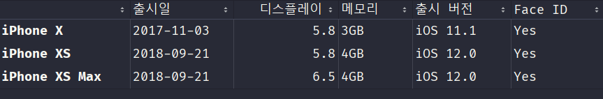

아래쪽 3개만 출력

---

### DataFrame - shape/info/describe

<a 
    href="https://pandas.pydata.org/docs/reference/api/pandas.DataFrame.shape.html"
    class="disable-href-underline">
    pandas.DataFrame.shape
</a>
DataFrame의 모양 (행/열 개수)을 확인할 수 있는 프로퍼티

<a 
    href="https://pandas.pydata.org/docs/reference/api/pandas.DataFrame.info.html"
    class="disable-href-underline">
    pandas.DataFrame.info
</a>
DataFrame의 정보 (column별 개수, 타입 등)을 확인하는 메소드

---

<a 
    href="https://pandas.pydata.org/docs/reference/api/pandas.DataFrame.describe.html"
    class="disable-href-underline">
    pandas.DataFrame.describe
</a>
DataFrame의 각 column의 통계값을 확인하는 메소드

---

### DataFrame - Sorting

<a 
    href="https://pandas.pydata.org/docs/reference/api/pandas.DataFrame.sort_values.html"
    class="disable-href-underline">
    pandas.DataFrame.sort_values
</a>
DataFrame을 Sort (정렬)하는 메소드

```python
# some_dataframe을 "column_name" column의 값에 따라 정렬 (오름차순)
some_dataframe.sort_values(by="column_name")

# some_dataframe을 "column_name" column의 값에 따라 정렬 (내림차순)
some_dataframe.sort_values(by="column_name", ascending=False)
```
역시 `inplace=True`를 해주면 원본 DataFrame을 정렬합니다.

---

# 예제

```python
iphone.sort_values("디스플레이", ascending=False)
```

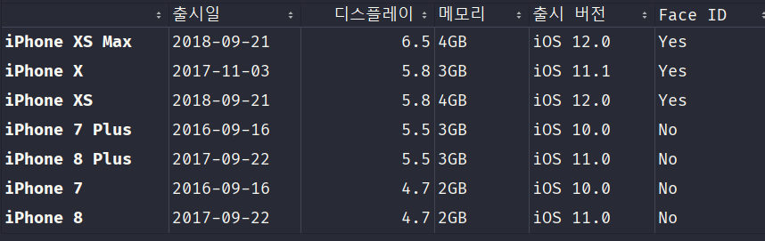
디스플레이 내림차순으로 정렬되어 출력

---

### Series - unique/value_counts

<a 
    href="https://pandas.pydata.org/docs/reference/api/pandas.Series.unique.html"
    class="disable-href-underline">
    pandas.Series.unique
</a>
Series의 중복된 값을 제거해서 알려주는 메소드

<a 
    href="https://pandas.pydata.org/docs/reference/api/pandas.Series.value_counts.html"
    class="disable-href-underline">
    pandas.Series.value_counts
</a>
Series에 중복된 값의 개수를 알려주는 메소드

---

### 예제 - unique

```python
iphone["출시 버전"].unique()
```

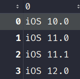

출시 버전 중 unique한 값만 출력

> 참고: unique()의 return 타입은 numpy array

---

### 예제 - value_counts

```python
iphone["출시 버전"].value_counts()
```

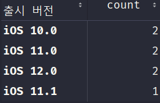

출시 버전의 중복된 값의 개수를 출력

> 참고: value_counts()의 return 타입은 pandas.Series

---

# DataFrame - Data Visualization

단순한 표 (DataFrame)을 통해서는
데이터가 의미하는 바를 직관적으로 알아보기 힘듭니다.

데이터 시각화를 통해 단순한 데이터(표)를
차트, 그래프 등과 같은 시각적 요소로 표현함으로써
데이터를 더 쉽게 이해하고 활용할 수 있습니다.

---

### DataFrame - plot

<a 
    href="https://pandas.pydata.org/docs/reference/api/pandas.DataFrame.plot.html"
    class="disable-href-underline">
    pandas.DataFrame.plot
</a>

<p style="font-size:68%">
pandas DataFrame의 plot 메소드를 통해 쉽고 빠르게 데이터 시각화를 할 수 있습니다.
`some_dataframe.plot(kind="plot_종류")` 형태로 사용하며 plot 종류는 다음과 같습니다.
</p>

<p style="font-size:70%">
* line (선 그래프)<br>
* bar (막대 그래프)<br>
* barh (수평 막대 그래프)<br>
* hist (히스토그램)<br>
* box (박스 그래프)<br>
* kde (밀도 분포 그래프)<br>
* area (영역 그래프)<br>
* pie (파이 그래프)<br>
* scatter (분산 그래프 / 산점도)<br>
* hexbin (육각형 그래프)<br>
</p>

---

### Data Visualization - Line Plot

선 그래프를 이용하면 값의 변화량을 파악하기 용이합니다.

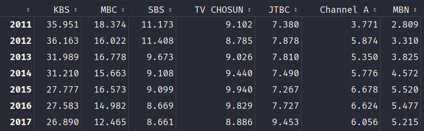
위와 같은 DataFrame을 예제로 봅시다.

---

### 예제 - Line Plot 

```python
broadcast.plot(kind="line")
```

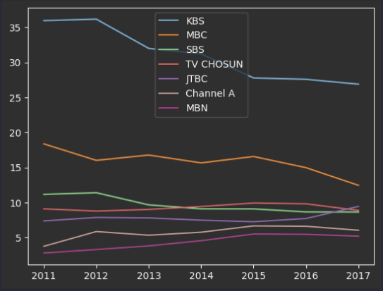

---

plot()에 y인수를 이용하면 column을 필터링 가능합니다.

```python
broadcast.plot(kind="line", y=["KBS", "MBC"])
```
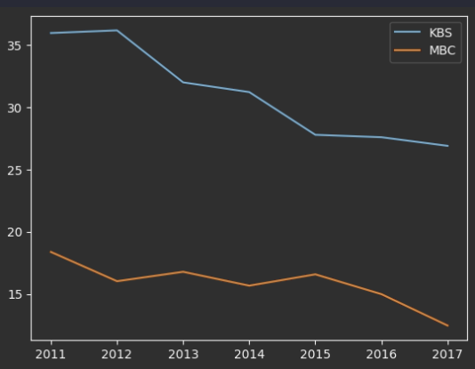

---

### Data Visualization - Bar Plot

막대 그래프를 이용하면 양, 대소관계 등을 파악하기 용이합니다.

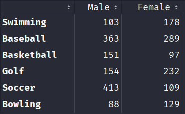
위와 같은 DataFrame을 예제로 봅시다.

---

### 예제 - Bar Plot

```python
sports.plot(kind="bar")
```
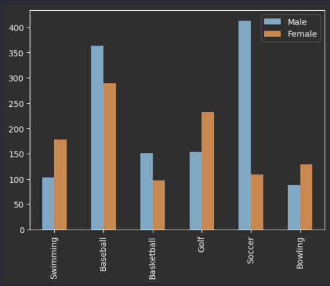

---

`stacked=True`를 이용하면 그래프를 겹쳐서 그릴 수 있습니다.

```python
sports.plot(kind="bar", stacked=True)
```

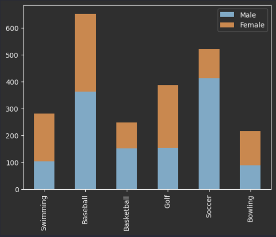

---

### Data Visualization - Pie Plot

파이 그래프를 이용하면 비율을 비교하기에 용이합니다.


위의 DataFrame을 다시 예제로 사용해서 봅시다.

---

### 예제 - Pie Plot

```python
broadcast.loc[2011].plot(kind="pie")    # 2011년의 시청률을 비교
```

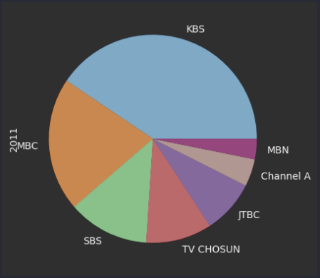

---

### Data Visualization - Histogram Plot

히스토그램을 이용하면 데이터의 분포를 파악하기 용이합니다.

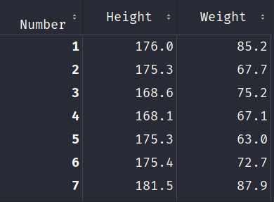

위의 DataFrame을 예시로 봅시다.

---

### 예제 - Histogram Plot

```python
body["Height"].plot(kind="hist")    # 키의 분포를 확인
```
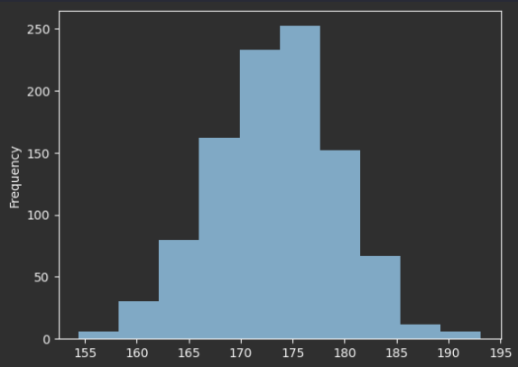

---

bins 인수로 히스토그램을 몇개로 나눌지 설정 가능합니다.

```python
body["Height"].plot(kind="hist", bins=20)   # 히스토그램을 20개로 나눔
```

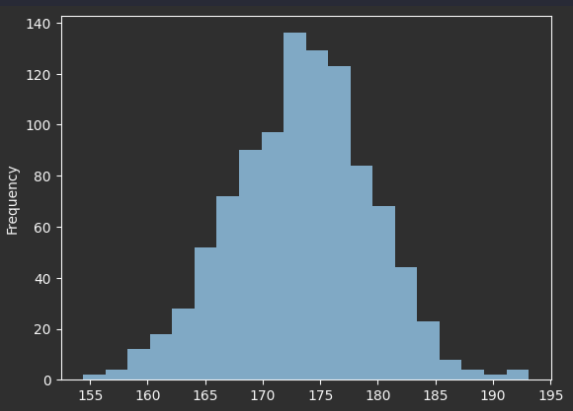

---

### Data Visualization - Bot Plot

박스 플롯을 이용하면 데이터가 분포된 정도와
이상치 (outlier)를 쉽게 확인 가능합니다.

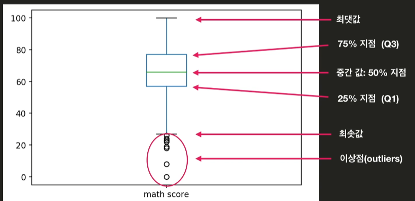

---

<p style="font-size:90%">
    참고: 박스 플롯이 생소할수도 있는데<br>
    주식 차트도 자세히 보면 박스 플롯입니다.
</p>

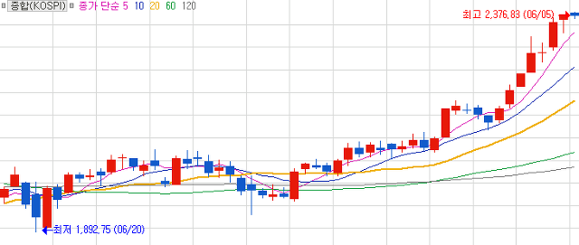

---

### 예제 - Box Plot

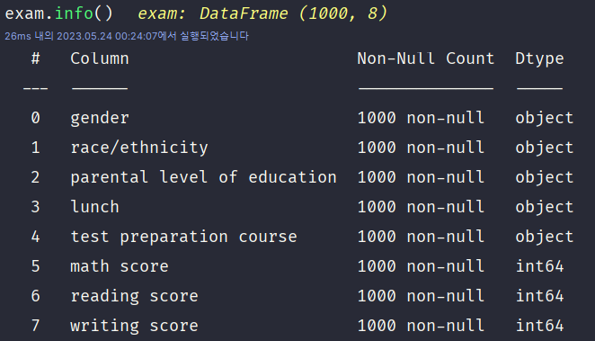

다음과 같은 DataFrame을 예시로 봅시다.

---

### 예제 - Box Plot

```python
# 수학, 읽기, 쓰기 점수를 박스 플롯으로 표시
exam.plot(kind="box", y=["math score", "reading score", "writing score"])
```

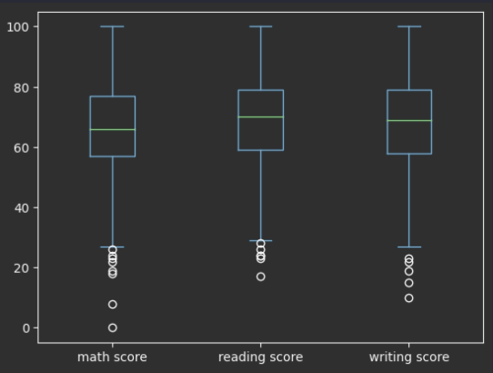

---

### Data Visualization - Scatter Plot

<p style="font-size:85%">
    분산 그래프 (산점도)를 이용하면 지표의 상관관계를 파악하기 용이합니다.
</p>


다시 위의 DataFrame을 예시로 봅시다.

---

### 예시 - Scatter Plot

```python
# 수학 점수와 읽기 점수의 상관관계를 분석
exam.plot(kind="scatter", y="math score", x="reading score")
```

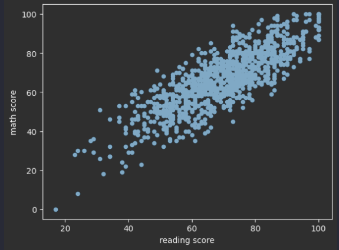

---

### Seaborn

pandas보다 더 다양한 그래프를 그릴 수 있게 해주는
데이터 시각화 라이브러리.

`pip install seaborn` 으로 설치합니다.

참고:
* pipenv: `pipenv install seaborn`
* anaconda: `conda install seaborn`
* poetry: `poetry add seaborn`

---

#### Probability Density Function (확률 밀도 함수)

분포도의 특정 범위에서 값이 존재할 확률을 나타내는 함수
위 함수를 그래프로 그리면 값의 분포를 알기 쉽습니다.

<br>

#### Kernel Density Estimation (커널 밀도 추정)

PDF와 KDE를 이용해 튀는 값을 뭉개서
분포도를 부드럽게 그릴 수 있습니다.

---

### 예제: KDE Plot


위의 DataFrame을 다시 예제로 봅시다.

---

### 예제: KDE Plot

<p style="font-size:60%">
우선 단순 분포도를 그려봅시다.
</p>

```python
height = body["Height"].value_counts().sort_index().plot(kind="line")
```
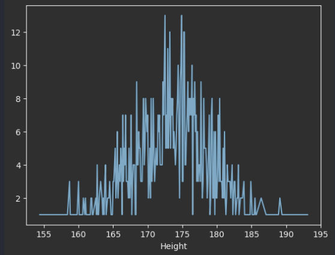

---

### 예제: KDE Plot

그래프가 튀는 값에 의해
보기 어렵게 그려지는것을 볼 수 있습니다.

이걸 KDE Plot으로 바꾸려면 다음과 같습니다.

```python
import seaborn
# read_csv 생략
seaborn.kdeplot(body["Height"])
```


---

### 결과: KDE Plot

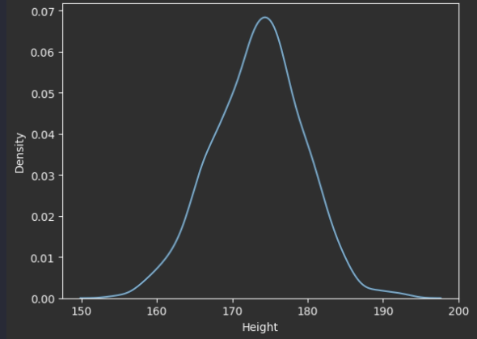

<p style="font-size:90%">
    단순 분포도보다 완만한 곡선으로 더 보기 쉬워진것을 알 수 있습니다.
</p>

---

### KDE - Bandwidth

KDE 함수의 Bandwidth 값을 조절하여
그래프의 뾰족한 정도를 결정할 수 있습니다.

`seaborn.kdeplot()` 메소드에서는 `bw`인수로 구현되어 있습니다.

---

### 예제: KDE Plot Bandwidth

```python
seaborn.kdeplot(body["Height"], bw=0.1)
```

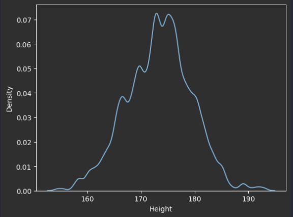
처음보다 더 뾰족해지는 것을 확인할 수 있습니다.

---

### Seaborn - KDE Plot with Histogram

<p style="font-size:90%">
히스토그램과 KDE 그래프를 같이 그려 비교하기 쉽게 만들수 있습니다.
</p>

<p style="font-size:80%;color:orange">
주의: Seaborn v0.14.0부터 distplot 메소드는 deprecated 되었습니다.
</p>

seaborn.histplot 메소드에 `kde=True` 인수를 넣어
히스토그램과 KDE를 동시에 그릴 수 있습니다.

```python
seaborn.histplot(some_dataframe, kde=True)
```

---

### 예제: KDE Plot with Histogram

```python
seaborn.histplot(body["Height"], kde=True)
```

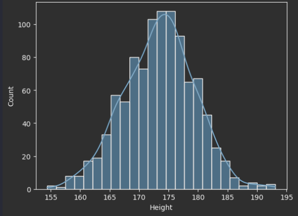

---

### Seaborn - Violin Plot

바이올린 플롯은 Box Plot처럼 최대/최소값을 보기 쉬우면서
동시에 분포된 정도도 확인할 수 있는 그래프입니다.

```python
seaborn.violinplot(y=some_dataframe)
```
형식으로 사용합니다.

---

### 예제: Violin Plot

```python
seaborn.violinplot(y=body["Height"])
```

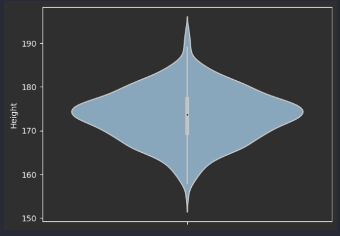

---

### Seaborn - 2차원 KDE Plot

두개의 값을 동시에 KDE 플롯을 그리면
등고선의 형태로 그래프가 그려집니다.

이것을 2차원 KDE Plot이라고 부릅니다.

분산 그래프(산점도)처럼 지표의 상관관계를 파악하며
동시에 분산된 정도도 확인하는데 용이합니다.

```python
seaborn.kdeplot(x=some_df["A"], y=some_df["B"])
```

위와 같이 kdeplot 메소드에 두개의 값을 넣어주어 사용합니다.

---

### 예제: 2차원 KDE Plot

```python
seaborn.kdeplot(x=body["Height"], y=body["Weight"])
```

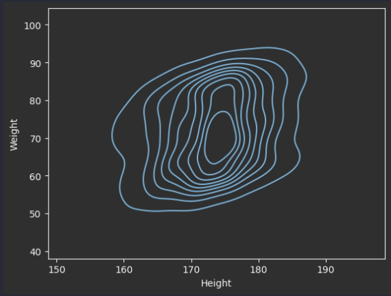

---

### Seaborn - LM Plot

분산 그래프(산점도)에 Regression Line(회귀선)을 그려서
상관관계를 더 단순히 표현하기 위한 그래프입니다.

```python
# some_df DataFrame의 column_name_1과 column_name_2의 LM Plot
seaborn.lmplot(data=some_df, x="column_name_1", y="column_name_2")
```
위와 같은 형태로 LM 플롯을 그릴 수 있습니다.

---

### 예제: LM Plot

```python
seaborn.lmplot(data=body, x="Height", y="Weight")
```

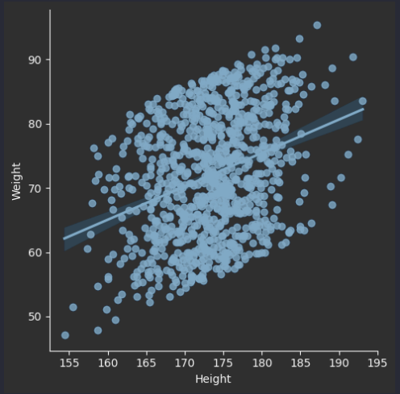

---

### Seaborn - Categorical Plot

데이터를 카테고리별로 묶어서 시각화도 가능합니다.

```python
seaborn.catplot(data=some_df, x="col1", y="col2", kind="plot_kind")
```
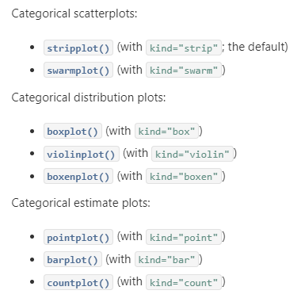

---

### 예제: Categorical Plot

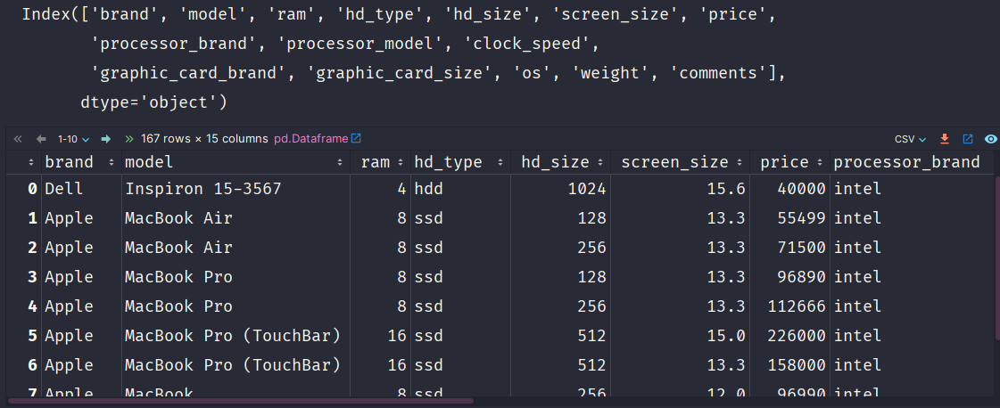

---

### 예제: Categorical Plot

```python
# os를 가격별로 그룹화해서 박스 그래프로 표현
seaborn.catplot(laptop, x="os", y="price", kind="box")
```

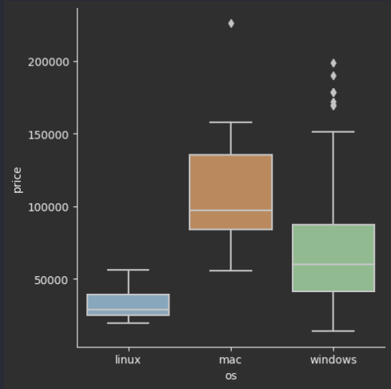

---

### 통계 기본 상식 - 중간값

말 그대로 중앙에 있는 값을 말합니다.

[1, 3, 6, 8, 11, 15, 19]
일때의 중간값은 8

[10, 20, 40, 60, 90, 120]
일때의 중간값은 (40 + 60) / 2 = 50

---

### Pearson Correlation Coefficient

피어슨 상관 계수: 두 변수의 연관성을 나타내는 계수입니다.
-1부터 1의 사이의 값만 나올 수 있습니다.

값이 1에 가까운 경우: 연관성이 높음
값이 -1에 가까운 경우: 연관성이 높지만 역의 관계임
값이 0에 가까운 경우: 연관성이 없음

---

### DataFrame - corr

<a 
    href="https://pandas.pydata.org/docs/reference/api/pandas.DataFrame.corr.html"
    class="disable-href-underline">
    pandas.DataFrame.corr
</a>

숫자 데이터 (int, float)의
상관계수 DataFrame을 반환하는 메소드입니다.

아래와 같은 형식으로 사용합니다.

```python
some_dataframe.corr()
```

---

### Seaborn - Heatmap

앞에서 corr()을 이용하여 상관계수 DataFrame을 가져왔습니다.
이를 Seaborn의 heatmap 메소드를 이용하면
더 쉽게 볼 수 있습니다.

아래와 같은 형식으로 사용합니다.

```python
seaborn.headmap(some_dataframe.corr())
```

---

### 예제: Heatmap


위의 DataFrame을 다시 예제로 봅시다.

---

### 예제: Heatmap

```python
score = exam[["math score", "reading score", "writing score"]]
seaborn.heatmap(score.corr())
```

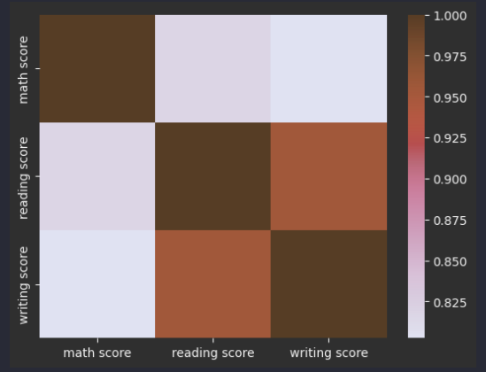

---

`annot=True`인수를 추가하면 값도 동시에 출력해 줍니다.

```python
score = exam[["math score", "reading score", "writing score"]]
seaborn.heatmap(score.corr(), annot=True)
```

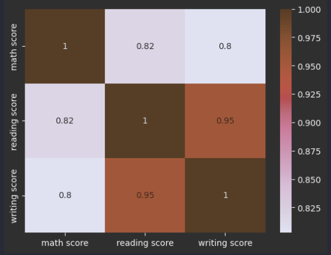

---

### Exploratory Data Analysis

EDA: 데이터를 다양한 관점에서 살펴보며 데이터의
의미를 파악하는것

* 각 row의 의미
* 각 column의 의미
* 데이터의 분포
* column간의 연관성

등을 시각적/통계적인 기법 등으로 데이터를 살펴보며
의미를 파악합니다.

---

### EDA - 기본 정보 파악하기

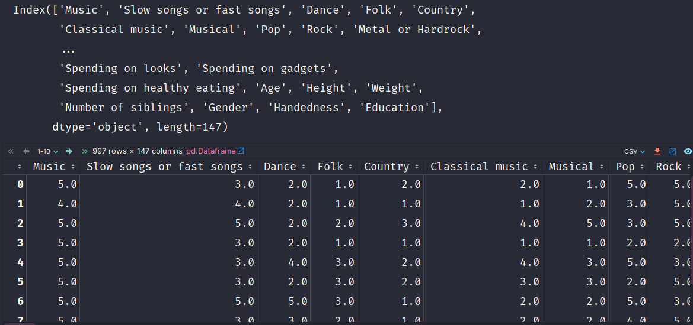
위와 같은 DataFrame을 예로 봅시다.

---

### 예제 - 설문조사 참가자 기본 정보

Column의 마지막 7개가
각각 나이, 키 몸무게, 형제 수, 성별, 오른손/왼손잡이, 학력
을 나타내는것을 알 수 있습니다.

총 147개의 column이 있으니 140~146번째의 column이겠죠.

이런 경우 iloc를 이용하여 쉽게 가져올 수 있습니다.

```python
basics = young_survey.iloc[:, 140:]  # 140~마지막까지의 col을 가져옴
```

---

### 결과 - 설문조사 참가자 기본 정보

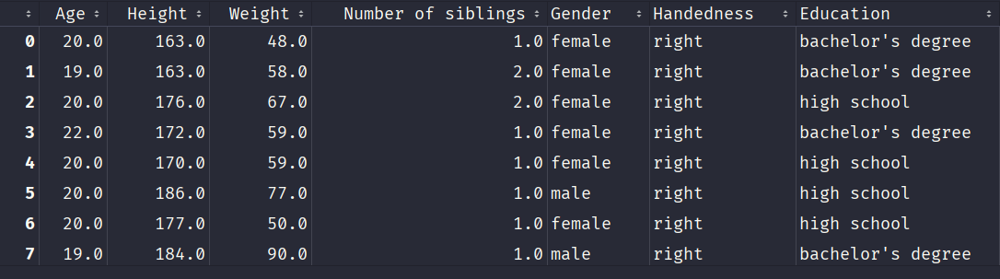

위와 같이 참가자들의 기본 정보를 가져온 것을 볼 수 있습니다.

---

### 예제 - 성별

기본 정보만을 추려냈으니, 더 쉽게 참가자의 정보를
알 수 있습니다.
예를 들어서 참가자들의 성비를 알고 싶다면
```python
basics["Gender"].value_counts()
```
를 이용하면 되겠죠.
더 나아가서 시각적으로 보고 싶다면
```python
basics["Gender"].value_counts().plot(kind="pie")
```
를 하면 되겠죠.

---

### 결과 - 성별

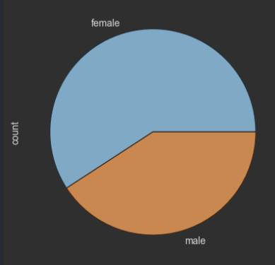

위의 일련의 과정을 통해 참가자는 여성이 더 많다는 것을
쉽게 확인할 수 있습니다.

---

### 예제 - 연령 분포

이번에는 연령 분포를 알아봅시다.

```python
basics["Age"].value_counts()
```
성별과 마찬가지로 Age column의 value_counts()를
가져오면 되겠죠. 마찬가지로 시각적으로 보고 싶다면

```python
seaborn.violinplot(data=basics, y="Age")
```

를 하면 되겟죠.

---

### 결과 - 연령 분포

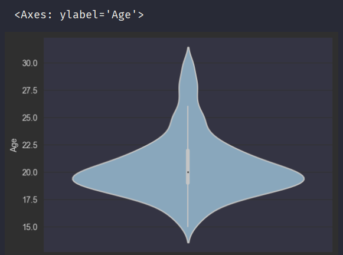

위를 통해 17살~20살 사이가 가장 참가자가 많은 것을
알 수 있습니다.

---

### 예제 - 성별별 연령 분포

성별마다 따로 연령 분포를 알고 싶다면 어떻게 하면 될까요?
단순히 `violinplot()`에 `x="Gender"`을 추가해주면 됩니다.
```python
seaborn.violinplot(data=basics, y="Age", x="Gender")
```

---

### 결과 - 성별별 연령 분포


남성/여성 모두 성별 분포가 비슷한 것을 알 수 있습니다.

---

### 상관 관계 분석

pandas.DataFrame의 corr() 메소드와
seaborn의 heatmap() 메소드를 이용하면
쉽게 column간의 상관관계를 파악할 수 있습니다.

---

### 예제 - 음악 선호도 간의 상관관계

<p style="font-size:85%">
다시 young_survey DataFrame을 살펴보면<br>
0번부터 19번까지가 음악 선호도에 관한 column인것을 알 수 있습니다.<br>
이것들의 상관계수를 구하려면
</p>

```python
music_corr = young_survey.iloc[:, :19].corr()
```

<p style="font-size:85%">
을 이용하면 되겠죠. 이것을 시각화하려면
</p>

```python
seaborn.heatmap(music_corr)
```

<p style="font-size:85%">
을 이용하면 됩니다.
</p>

---

### 결과 - 음악 선호도 간의 상관관계


<p style="font-size:80%">
위의 Heatmap을 통해 음악 장르 선호도 간의 상관관계를 알 수 있습니다.<br>
예를 들면 색이 진한 펑크와 락은 서로 겹치는 팬층이 많다고 해석할 수 있겠죠.
</p>

---

### Cluster Analysis

요소들을 비슷한 경향을 가진 집단으로 묶는 것을
클러스터 분석이라고 합니다.

비슷한 경향 = 상관관계가 높음

일테니까 상관계수가 높은 요소끼리 묶으면 좋겠죠.

---

### 예제 - Cluster Analysis

young_survey DataFrame을 다시 살펴보면, 
History column부터 Pets column까지가
관심사에 관한 것임을 알 수 있습니다.

이것들의 상관 관계를 구하려면

```python
interests = young_survey.loc[:, "History":"Pets"].corr()
```
를 해주면 되겠죠.

---

### 예제 - Cluster Analysis

Seaborn에는 클러스터링을 하기 쉽게 도와주는
clustermap 메소드가 존재합니다.

기본적으로 Heatmap을 기반으로 하는 플롯이죠.

위에서 구한 관심사들을 클러스터링 하려면
다음과 같이 사용하면 됩니다.

```python
seaborn.clustermap(interests)
```

---


<p style="font-size:80%">위와 같이 상관계수가 높은 column 끼리 묶어서 표현해주는것을 알 수 있습니다.</p>

---

### DataFrame - sum

<a 
    href="https://pandas.pydata.org/docs/reference/api/pandas.DataFrame.sum.html"
    class="disable-href-underline">
    pandas.DataFrame.sum
</a>

DataFrame의 sum 메소드를 이용해서
index나 column의 합을 구할 수 있습니다.

```python
some_dataframe.sum(axis="columns")  # Column의 합
some_dataframe.sum(axis="index")    # index의 합
```

---

### 예제: sum


위의 DataFrame을 예제로 봅시다.

---

### 예제: sum

년도별로 시청률의 합계를 구하려면 column끼리 더하면 되겠죠.
```python
total = broadcast.sum(axis="columns")
```


`sum(axis="columns")`로 column의 합계를 볼 수 있습니다.

---

이 합계를 원본 DataFrame의 새로운 column으로 넣어봅시다.

```python
broadcast["Total"] = total
```


기존 값들을 통해 새로운 값을 만들어 내면,
이전의 데이터만으로는 볼 수 없던 새로운 정보를
알아낼수도 있습니다.

---

Total을 시각화해보면

```python
df.plot(kind="line", y="Total")
```

이렇게 점점 TV 시청률이 줄어드는것을 알 수 있습니다.

---

### Series - str

pandas.Series의 str프로퍼티를 이용하면
각각의 문자열에 대한 조작을 할 수 있습니다.

파이썬 map()함수나 JS의 Array.map() 메소드랑 비슷하네요.

---

### 예제: str


위의 DataFrame의 예제로 봅시다.

---

### 예제: str

Genre가 Rock를 포함하는 모든 열을
가져오고 싶다고 해 봅시다.

```python
has_rock = album["Genre"].str.contains("Rock")
```
위의 코드를 통해 Genre column의 모든 데이터에 대해
`contains()` (파이썬 문자열 빌트인 메소드)를
실행시킬 수 있습니다.
실행시킨 결과는 새로운 Series를 통해서 반환됩니다.
즉, Genre에 "Rock"을 포함하는 열은 True를,
아닌 열은 False인 Series가 반환된다는 소리입니다.

---

위의 Series를 통해 원본 DataFrame을 필터링하면

```python
album.loc[has_rock]
```


Genre가 Rock을 포함하는 모든 row가 출력됩니다.

---

### Series - str.split

파이썬에서 문자열의 split 메소드는 원하는 문자열을 기준으로
문자열을 분리해서 새로운 리스트로 만들어 주는 메소드입니다.

pandas.Series의 str프로퍼티에도 split이 구현되어 있고,
일반적인 split과 다르게 분리된 문자열을
새로운 DataFrame으로 만들 수도 있습니다.

```python
# 문자열을 "/" 기준으로 나눠서 Series로 반환
some_df["some_str_col"].str.split("/")

# 문자열을 공백 (띄어쓰기) 기준으로 1번만 나누고, DataFrame으로 반환
some_df["some_str_col"].str.split(n=1, expand=True)
```

---

### 예제: str.split


위의 DataFrame을 예제로 봅시다.

---

### 예제: str.split

소재지도로명주소에서 관할구역 (도/특별시/광역시)을
분리하고 싶다고 하면
```python
state = parks["소재지도로명주소"].str.split(n=1, expand=True)
```


---

이걸 새로운 column으로 넣어주려면 아래와 같습니다.
```python
parks["관할구역"] = state[0]
```


---

### Series - map

pandas.Series의 map 메소드를 통해서, 
각각의 값을 다른 값으로 변환해 줄 수 있습니다.

```python
col_map_dict = {
    "A": "Group 1",
    "B": "Group 1",
    "C": "Group 2"
}

 # A, B는 Group 1, C는 Group 2로 변환해서 Series로 반환
some_df["col"].map(col_map_dict)   
```

---

### 예제: map


위의 예제로 봅시다.

---

### 예제: map

brand (제조사)의 국적은 다음과 같습니다.
* Dell, Apple, Ailenware, Microsoft = 미국
* Acer, Asus = 대만
* Lenovo = 중국

이를 dict로 변환하면 아래와 같습니다.
```python
brand_nationality = {
    "Dell": "U.S","Apple": "U.S","Ailenware": "U.S","Microsoft": "U.S",
    "Acer": "Taiwan", "Asus": "Taiwan", "Lenovo": "China"
}
```

---

이를 map을 통해 변환하면

```python
nat = laptop["brand"].map(brand_nationality)
```


위와 같이 brand에 맞는 국적의 Series가 반환됩니다.

---

이것을 원본 DataFrame에 넣어주면

```python
laptop["Nationality"] = nat
```


국적이 추가되는것을 볼 수 있습니다.

---

### DataFrame - groupby

<a 
    href="https://pandas.pydata.org/docs/reference/api/pandas.DataFrame.groupby.html"
    class="disable-href-underline">
    pandas.DataFrame.groupby
</a>

groupby 메소드를 통해서 특정 column의 값에 따라
그룹화 할 수 있습니다.

```python
# some_dataframe을 "col" column의 값이 같은 row마다 그룹화 
some_dataframe.groupby("col")
```

---

### DataFrame - groupby.count

groupby를 통해 묶어준 DataFrame의
column별 값의 개수를 알 수 있습니다.

```pyton
laptop.groupby("Nationality").count()
```


---

### DataFrame - groupby.max / groupby.min

max, min 메소드로 각 그룹의 최대/최소값을 알 수 있습니다.

```python
laptop.groupby("Nationality").max()
```


---

### DataFrame - groupby 기타 메소드

* mean(): 각 그룹의 평균값
* first(): 각 그룹의 첫번째 값
* last(): 각 그룹의 마지막 값
* plot(): 일반 DataFrame과 마찬가지로 시각화 가능

---

### DataFrame - merge

<a 
    href="https://pandas.pydata.org/docs/reference/api/pandas.DataFrame.merge.html"
    class="disable-href-underline">
    pandas.DataFrame.merge
</a>

RDB의 TABLE JOIN과 같이,
DataFrame과 다른 DataFrame을 합치는 메소드

```python
# some_df와 another_df의 key column을 기준으로 letf join
pandas.merge(some_df, another_df, on="key", how="left")
```

---

### DataFrame - Merge Type

Merge 방식도 SQL의 JOIN과 똑같습니다.


---

### 예제: Merge


위와 같은 DataFrame을 예제로 봅시다.

---

### 예제: Inner Join

```python
pandas.merge(quantity, price, on="Product", how="inner")
```


left (quantity), right(price) 양쪽 모두에 존재하는
Potato, Onion, Avocado row만 병합된것을 볼 수 있습니다.

---

### 예제: Left Join

```python
pandas.merge(quantity, price, on="Product", how="left")
```


<p>
왼쪽 (quantity)에 존재하는 값은 모두 표시되지만, <br>
오른쪽 (price)에 존재하는 값은 서로 중복되는 값을 제외하고는 <br>
병합되지 않는것을 볼 수 있습니다.
</p>

---

### 예제: Right Join

```python
pandas.merge(quantity, price, on="Product", how="right")
```


<p style="font-size:90%">
오른쪽 (price)에 존재하는 값은 모두 표시되지만, <br>
왼쪽 (quantity)에 존재하는 값은 서로 중복되는 값을 제외하고는 <br>
병합되지 않는것을 볼 수 있습니다.
</p>

---

### 예제: Full Outer Join

```python
pandas.merge(quantity, price, on="Product", how="outer")
```


중복되지 않는 값들도 모두 병합되서
출력되는것을 볼 수 있습니다.